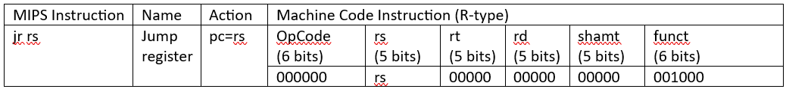

# Sample Modification Question 2 - jr
## Question
Modify the [already given code](../../Sample%20Codes/SingleCycle.v) of the 32 bits single cycle MIPS processor to include jr instruction according to the following conventions:


> jr instruction format

<details>
<summary>
	
## Solution
</summary>

Final Code : [SingleCycleV1.v](SingleCycleV1.v)

Testbench : [testbenchv1.v](testbenchv1.v)

memfile.dat : [memfile.dat](memfile.dat)

</details>

<details>
<summary>
	
## Solution Explanation
</summary>

### Video Explanation [Click here](https://www.youtube.com/watch?v=YdMKU0FelT4)
### Instruction
- The Jump Register instruction causes the PC to jump to the contents stored in the first source register `rs`. 
- It is an R-type instruction. 
### Changes in code
The `jr` instruction requires the `pcnext` to be updated as the contents of the register `rs`. Both `pcnext` and `rs` contents are available only in the `datapath`. Hence, the `controller` module has to pass on a new control signal `jr` to instruct `datapath` operations.

**1. top module** <br>
    No changes are to be made since there is no new operation to be done in between `imem` instruction memory, `dmem` data memory and `mips` module.

**2. dmem module**<br>
    No changes since no data updation.

**3. imem module**<br>
    No change.

**4. mips module**<br>
```verilog
module  mips(input clk, reset,
				output [31:0] pc,
				input [31:0] instr,	
				output memwrite,
				output [31:0] aluout, writedata,
				input [31:0] readdata);
	
	wire memtoreg, branch,
	alusrc, regdst, regwrite, jump, jr;
	wire [2:0] alucontrol;
	controller c(instr[31:26], instr[5:0], zero,memtoreg, memwrite, pcsrc,alusrc, regdst, regwrite, jump,jr, alucontrol);
	datapath dp(clk, reset, memtoreg, pcsrc,alusrc, regdst, regwrite, jump,jr,alucontrol,zero, pc, instr,aluout, writedata, readdata);

endmodule
```
New signal `jr` from `controller` module, which is used to control the operations in `datapath`, is added in between them.


**5. controller module**<br>
```verilog
module controller (input [5:0] op, funct,
						input zero,
						output memtoreg, memwrite,
						output pcsrc, alusrc,
						output regdst, regwrite,
						output jump,
						output jr,
						output [2:0] alucontrol);
						
	wire [1:0] aluop;
	wire branch;
	maindec md (op,funct, memtoreg, memwrite, branch,alusrc, regdst, regwrite, jump,jr,aluop);
	aludec ad (funct, aluop, alucontrol);
	assign pcsrc = branch & zero;
endmodule
```
`controller` module needs to give a new output control signal `jr`. `maindec` needs `funct` to generate the control signals for jr instruction. 

**6. maindec module**<br>
```verilog
module maindec(input [5:0] op,funct,
				output memtoreg, memwrite,
				output branch, alusrc,
				output regdst, regwrite,
				output jump,
				output jr,
				output [1:0] aluop);
				
	reg [9:0] controls;
	assign {regwrite, regdst, alusrc,branch, memwrite,memtoreg, jump, jr,aluop} = controls;
	always @ (*)
	case(op)
		6'b000000: 	case(funct)
	        		6'b001000:controls <=10'b0000000100; //JR
					default:controls <=10'b1100000010;//Other Rtype
					endcase
		6'b100011: 	controls <=10'b1010010000; //LW
		6'b101011: 	controls <=10'b0010100000; //SW
		6'b000100: 	controls <=10'b0001000001; //BEQ
		6'b001000: 	controls <=10'b1010000000; //ADDI
		6'b000010: 	controls <=10'b0000001000; //J
		default: 	controls  <=10'bxxxxxxxxx; //???
	endcase
endmodule
```
`maindec` needs new control signal `jr` and also new case using `funct` just for jr instruction.

**7. aludec module**<br>
No changes since no new alu operations are to be performed.

**8. datapath module**<br>
```verilog
module datapath (input clk, reset,
						input memtoreg, pcsrc,
						input alusrc, regdst,
						input regwrite, jump,input jr,
						input [2:0] alucontrol,
						output zero,
						output [31:0] pc,
						input [31:0] instr,
						output [31:0] aluout, writedata,
						input [31:0] readdata);
							
	wire [4:0] writereg;
	wire [31:0] pcnext, pcnextbr, pcplus4, pcbranch, pcnextj;
	wire [31:0] signimm, signimmsh;
	wire [31:0] srca, srcb;
	wire [31:0] result;
	
	// next PC 
	flopr #(32) pcreg(clk, reset, pcnext, pc);
	adder pcadd1 (pc, 32'b100, pcplus4);
	sl2 immsh(signimm, signimmsh);
	adder pcadd2(pcplus4, signimmsh, pcbranch);
	mux2 #(32) pcbrmux(pcplus4, pcbranch, pcsrc,pcnextbr);
	mux2 #(32) pcmux(pcnextbr, {pcplus4[31:28],instr[25:0], 2'b00},jump, pcnextj);
	mux2 #(32) pcmuxjr(pcnextj, srca, jr, pcnext); //for jr instr
	
	// register file 
	regfile rf(clk, regwrite, instr[25:21],instr[20:16], writereg,result, srca, writedata);
	mux2 #(5) wrmux(instr[20:16], instr[15:11],regdst, writereg);
	mux2 #(32) resmux(aluout, readdata,memtoreg, result);
	signext se(instr[15:0], signimm);
	
	// ALU 
	mux2 #(32) srcbmux(writedata, signimm, alusrc,srcb);
	alu alu1(srca, srcb, alucontrol,aluout, zero);
endmodule

```
A new 2x1 mux is added to select between `pcnextjr` and `srca` (read from register file) using `jr` control signal from controller. Result is given to `pcnext`.

**9. regfile module**<br>
No changes since no new conventions for register accessing.

**10. supplementary modules** <br>
No changes.

**11. alu module**<br>
No changes since no alu operation is to be done for jr instruction.


</details>
